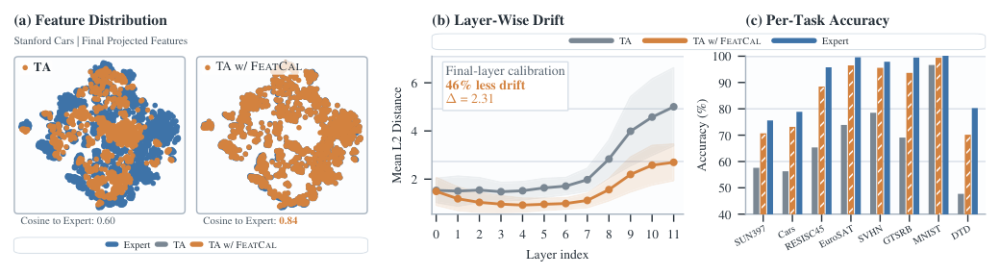
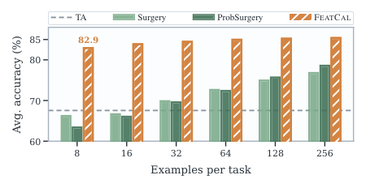

# FeatCal: Feature Calibration for Post-Merging Models

[](https://arxiv.org/abs/2605.13030)

Official code for **FeatCal: Feature Calibration for Post-Merging Models**
([arXiv:2605.13030](https://arxiv.org/abs/2605.13030)).

This self-contained demo reproduces the CLIP ViT-B/32 8-task Task Arithmetic +
FeatCal result.

## Paper Overview

Model merging combines task experts into a single model, but the merged model can
still underperform the experts. FeatCal studies this gap through feature drift:
the difference between features produced by the merged model and by the task
expert on the same input. It then calibrates the merged model layer by layer in
forward order using a small calibration set.

FeatCal updates model weights with closed-form solutions. It does not use
gradient descent, iterative optimization, extra modules, or an auxiliary
inference path.



## Paper Highlights

This repository currently provides a lightweight reproduction of the CLIP
ViT-B/32 8-task Task Arithmetic + FeatCal setting. Broader CLIP, FLAN-T5, and
MergeBench results are reported in the paper.

| Setting | Baseline | + FeatCal |
|---|---:|---:|
| CLIP ViT-B/32 TA, 8 tasks | 67.5 | 85.5 |
| FLAN-T5-base GLUE TA | 78.9 | 85.2 |
| Llama-3.2-3B MergeBench TA | 60.1 | 62.1 |
| Llama-3.1-8B MergeBench TA | 63.5 | 65.8 |

## Demo Setting

- Backbone: `openai/clip-vit-base-patch32`
- Tasks: SUN397, Stanford Cars, RESISC45, EuroSAT, SVHN, GTSRB, MNIST, DTD
- Merging baseline: Task Arithmetic, scaling factor `0.3`
- Post-merging method: FeatCal
- Calibration samples: `256` per task
- Reproduction hyperparameters: `lambda_ratio=0.05`,
  `anchor_blend_rho=2.2`, `teacher_interp_alpha=0.25`

The FeatCal script parameters above match the reference run used for this demo.
The paper's main-text default is `rho=2.0, alpha=0.3`; both are conservative
settings, but the numbers below use the script-aligned values.

## Expected Results

With full test-set evaluation, the expected accuracy is:

| Method | Average accuracy |
|---|---:|
| Task Arithmetic | 67.55 |
| Task Arithmetic + FeatCal | 85.47 |

Per-task reference accuracies:

| Task | TA | TA + FeatCal |
|---|---:|---:|
| SUN397 | 57.01 | 70.07 |
| Stanford Cars | 55.70 | 72.52 |
| RESISC45 | 64.75 | 87.94 |
| EuroSAT | 73.30 | 96.22 |
| SVHN | 77.93 | 95.06 |
| GTSRB | 68.50 | 93.21 |
| MNIST | 96.07 | 98.81 |
| DTD | 47.13 | 69.95 |

Small numeric differences can occur from dependency versions and dataloader
ordering, but the average should match closely when using the same seed and full
datasets.

## Sample Efficiency

In the CLIP ViT-B/32 8-task TA analysis, FeatCal reaches strong accuracy with a
small number of calibration examples per task and saturates quickly.



## Clone

```bash
git clone https://github.com/egangu/featcal.git
cd featcal
```

## Install

Create a lightweight Python environment:

```bash
python -m venv .venv
source .venv/bin/activate
pip install --upgrade pip
pip install -e .
```

For CUDA machines, install the PyTorch build matching your CUDA driver first,
then run `pip install -e .`. Example:

```bash
pip install torch --index-url https://download.pytorch.org/whl/cu121
pip install -e .
```

The first run downloads CLIP weights and datasets from Hugging Face. You can set
standard cache variables before running:

```bash
export HF_HOME=$PWD/.cache/huggingface
export HF_DATASETS_CACHE=$HF_HOME/datasets
export HF_HUB_CACHE=$HF_HOME/hub
```

If your network requires a Hugging Face mirror or HTTP(S) proxy, set those
environment variables in your shell before launching the demo. This repository
does not hard-code any mirror or proxy address.

## Run

Full reproduction:

```bash
bash scripts/run_ta8.sh
```

Equivalent Python command:

```bash
python -m featcal.run_ta8 \
  --output-dir outputs/clip-vit-b32-ta8 \
  --device auto
```

Outputs are written to:

```text
outputs/clip-vit-b32-ta8/
  run_config.json
  ta/
    config.json
    model.safetensors
    metrics.json
    run.log
  featcal-ta/
    config.json
    model.safetensors
    metrics.json
    run.log
```

`run.log` is a single-line JSON report for compatibility with the reference
logs. `metrics.json` is the same report formatted for reading.

## Smoke Check

For a cheap two-task run over tiny calibration/evaluation subsets:

```bash
bash scripts/run_smoke.sh
```

This is only a software check. It is not meant to reproduce the paper table.

## Useful Options

Evaluate on a small subset while debugging:

```bash
python -m featcal.run_ta8 --max-eval-samples 512
```

Use a specific GPU:

```bash
CUDA_VISIBLE_DEVICES=0 python -m featcal.run_ta8 --device cuda
```

Reuse an existing Task Arithmetic checkpoint:

```bash
python -m featcal.run_ta8 \
  --skip-ta \
  --ta-model-path outputs/clip-vit-b32-ta8/ta \
  --output-dir outputs/clip-vit-b32-ta8
```

Run only the Task Arithmetic baseline:

```bash
python -m featcal.run_ta8 --skip-featcal
```

## Implementation Notes

Task Arithmetic is implemented as:

```text
theta_TA = theta_base + 0.3 * sum_i(theta_expert_i - theta_base)
```

FeatCal calibrates CLIP vision encoder layers in forward order. For each layer,
it collects current merged-model features and task-expert features on the
calibration split, then solves closed-form updates for Linear weights, Linear
biases, and LayerNorm affine parameters. Test data is used only for final
evaluation.

## Citation

If you find this repository useful, please cite:

```bibtex
@misc{gu2026featcalfeaturecalibrationpostmerging,
      title={FeatCal: Feature Calibration for Post-Merging Models}, 
      author={Yanggan Gu and Shuo Cai and Zihao Wang and Wenjun Wang and Yuanyi Wang and Pengkai Wang and Sirui Huang and Su Lu and Jianmin Wu and Hongxia Yang},
      year={2026},
      eprint={2605.13030},
      archivePrefix={arXiv},
      primaryClass={cs.LG},
      url={https://arxiv.org/abs/2605.13030}, 
}
```
